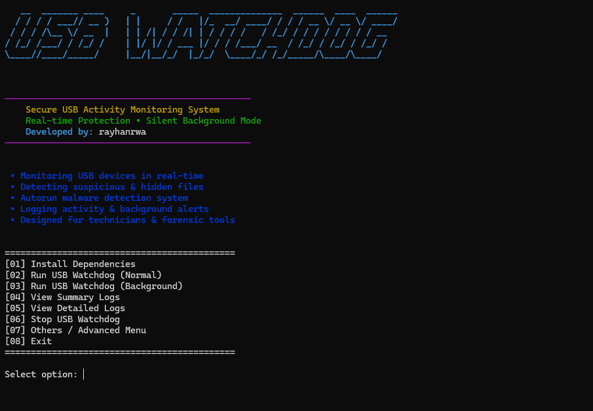
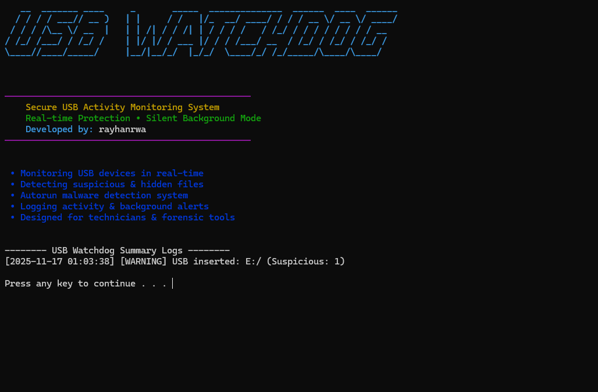

# USB Watchdog

---

## 🛡 GitHub Badges

---

## 🔍 Overview

USB Watchdog is a lightweight security tool designed to monitor USB activity, detect suspicious files, and protect devices during maintenance or service operations.

This tool provides real-time USB monitoring, hidden file detection, autorun malware alerts, and fully silent background operation.  
It is ideal for technicians, computer service centers, and digital forensics.

---

## 📸 Screenshots

### 🔷 Main Menu

### 🔷 Summary Log View

---

## 🚀 Features

- Real-time USB plug/unplug detection
- Hidden file & suspicious shortcut detection
- Autorun malware alert system
- Summary & detailed file activity logging
- Background silent mode via `pythonw.exe`
- Windows notification system
- Advanced tools: restart, clean logs, status check, silent mode toggle

---

## 📘 Documentation

- 🔧 [Installation Guide](docs/INSTALLATION.md)
- 📄 [About USB Watchdog](docs/ABOUT_WATCHDOG.md)
- 🔐 [Privacy Policy](docs/PRIVACY_POLICY.md)

---

## 📂 Project Structure

USBWatchdog/
├── service/
│ ├── usb_watchdog_service.py
│ ├── usb_monitor.py
│ ├── detector.py
│ ├── notifier.py
│ └── logger.py
│
├── tools/
│ └── banner.py
│
├── logs/
│ ├── activity.log
│ └── detail.log
│
├── assets/
│ └── images/
│ ├── main-menu.png
│ └── log-view.png
│
├── docs/
│ ├── INSTALLATION.md
│ ├── ABOUT_WATCHDOG.md
│ └── PRIVACY_POLICY.md
│
├── install.bat
├── run.bat
└── README.md

---

## 🛠 How It Works

- `usb_monitor.py` → listens for USB insertion/removal
- `detector.py` → scans for hidden files, autorun.inf, fake .jpg.exe malware
- `logger.py` → writes summary & detailed logs
- `notifier.py` → Windows toast notifications
- `usb_watchdog_service.py` → orchestrates monitoring threads

---

## 📝 Changelog

### **v1.0.2 — (Current)**

- Added startup banner for logs
- Improved advanced menu UI
- Added background process validation
- Better thread stability & error handling
- README improved with badges and screenshots

### **v1.0.1**

- Added silent mode toggle
- Added notification test
- Added restart watchdog function
- Added cleaner for logs

### **v1.0.0**

- Initial release
- Real-time USB monitoring
- File scanning & event logging added
- Autorun detection system added

---

## 📜 License

This project is licensed under the **MIT License**.  
See the full license text in the [LICENSE](LICENSE) file.

Copyright (c) 2025 Rayhan Rizky Widi Ananta

Permission is hereby granted, free of charge, to any person obtaining a copy
of this software and associated documentation files (the "Software"), to deal
in the Software without restriction, including without limitation the rights
to use, copy, modify, merge, publish, distribute, sublicense, and/or sell
copies of the Software, and to permit persons to whom the Software is
furnished to do so, subject to the following conditions:

The above copyright notice and this permission notice shall be included in all
copies or substantial portions of the Software.

THE SOFTWARE IS PROVIDED "AS IS", WITHOUT WARRANTY OF ANY KIND, EXPRESS OR
IMPLIED, INCLUDING BUT NOT LIMITED TO THE WARRANTIES OF MERCHANTABILITY,
FITNESS FOR A PARTICULAR PURPOSE AND NONINFRINGEMENT. IN NO EVENT SHALL THE
AUTHORS OR COPYRIGHT HOLDERS BE LIABLE FOR ANY CLAIM, DAMAGES OR OTHER
LIABILITY, WHETHER IN AN ACTION OF CONTRACT, TORT OR OTHERWISE, ARISING FROM,
OUT OF OR IN CONNECTION WITH THE SOFTWARE OR THE USE OR OTHER DEALINGS IN THE
SOFTWARE.

---

## 🧑‍💻 Author by

Developed by **rayhanrwa**  
For inquiries, improvements, or contributions—feel free to reach out or open an issue.
